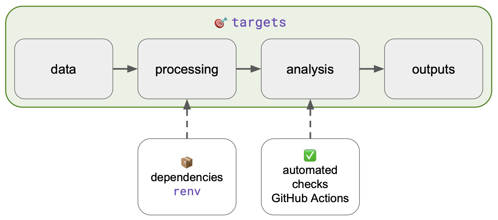
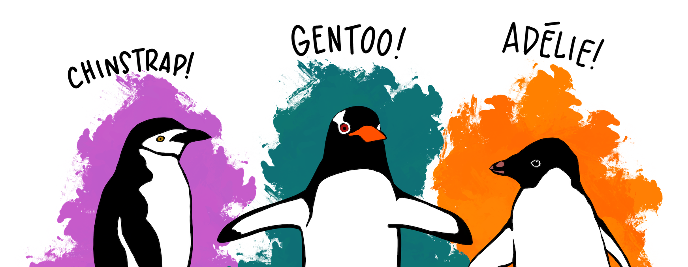
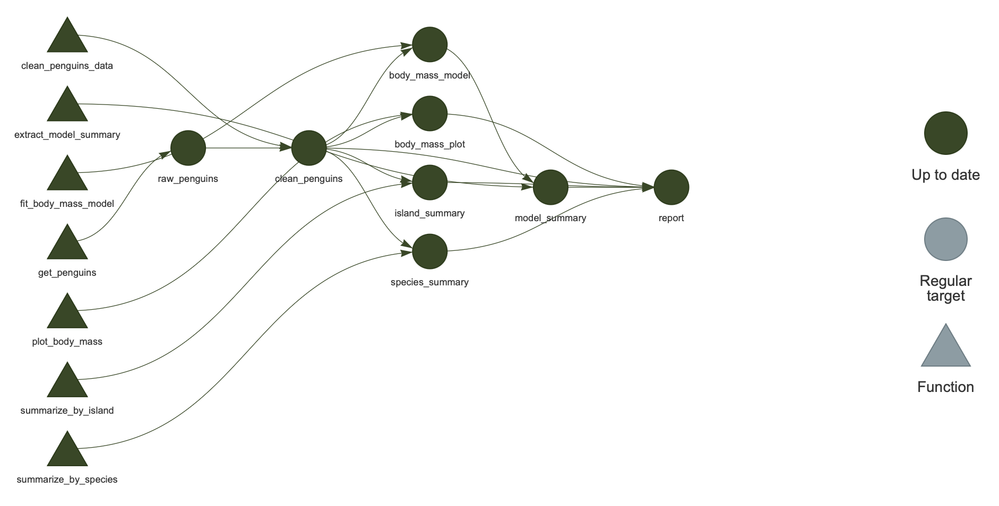
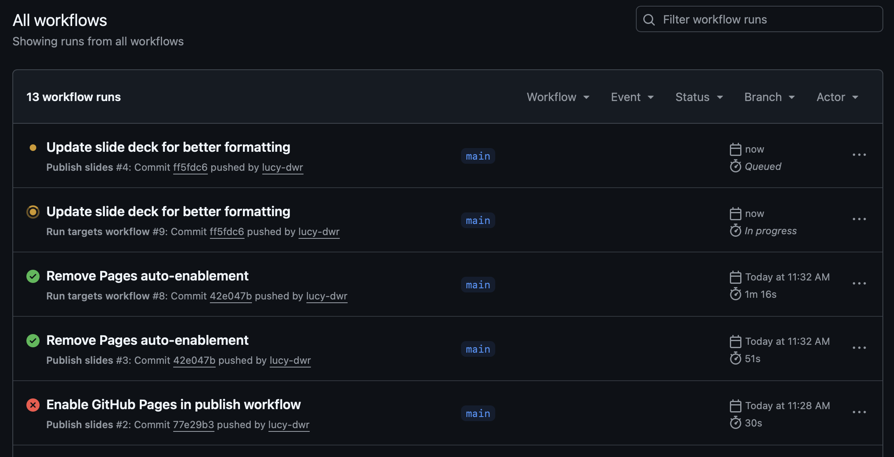

## What do we mean by reproducibility?

<div class="gap"></div>

- The same inputs and code can regenerate the same outputs
- The project records the software environment needed to run
- The workflow makes dependencies and execution order explicit
- Changes can be checked automatically before results are trusted

## Sometimes projects are reproducible only in the author's head!

<div class="gap"></div>

- Scripts must be run in the "right" order
- Some outputs are saved manually
- Package versions are unknown
- Results may be stale relative to the code
- No automated check confirms that the project still runs

## A reproducible project has a visible chain of evidence



## Three recurring reproducibility problems {.smaller}

<div class="gap"></div>
<div class="gap"></div>
<div class="gap"></div>

| Problem | Tool | What it protects against |
|:--------|:-----|:-------------------------|
| "What order do I run the scripts in?" | `targets` | Hidden dependencies, stale outputs |
| "Why does this work on my machine but not yours?" | `renv` | Package version drift |
| "How do I know this still works?" | GitHub Actions | Silent breakage, collaboration risk |

: {tbl-colwidths="[38,17,45]"}

## Worked example: Palmer penguins

<div class="gap"></div>

**Analytical question:**
How do body mass patterns differ among penguin species and islands?

{fig-align="center"}

::: {style="font-size: 0.5em; color: #888;"}
Illustration by Allison Horst
:::

## Worked example: Palmer penguins

<div class="gap"></div> 

**The workflow produces:**

- Cleaned analysis dataset
- Summary tables by species and island
- Exploratory figure
- Simple linear regression model
- Rendered Quarto report

## The workflow produces analysis artifacts

<div class="gap"></div>
<div class="gap"></div>
<div class="gap"></div>

```text
outputs/
├── penguins_clean.rds
├── species_summary.csv
├── body_mass_plot.png
├── model_summary.rds
└── report.html
```

<div class="gap"></div>

The pipeline defines **what the products are** and **how to make them**.

## A reproducible repository has a shape {.smaller}

<div class="gap"></div>
<div class="gap"></div>
<div class="gap"></div>

:::: {.columns}

::: {.column width="47%"}
```text
reproducible-r-workflow-demo/
├── _targets.R
├── renv.lock
├── .Rprofile
├── README.md
├── *.Rproj
│
├── R/
│   ├── data.R
│   ├── clean.R
│   ├── summarize.R
│   ├── visualize.R
│   └── model.R
```
:::

::: {.column width="6%"}
:::

::: {.column width="47%"}
```text
├── reports/
│   └── penguins_report.qmd
│
├── slides/
│   └── reproducible_r_workflows.qmd
│
├── outputs/
│
├── data/
│
└── .github/
    └── workflows/
        ├── run-targets.yaml
        └── publish-slides.yaml
```
:::

::::

## What belongs where? {.smaller}

<div class="gap"></div>
<div class="gap"></div>
<div class="gap"></div>

| Location | Purpose |
|:---------|:--------|
| `_targets.R` | Defines the workflow |
| `R/` | Stores reusable analysis functions |
| `reports/` | Quarto reports that consume pipeline outputs |
| `slides/` | Presentation materials |
| `renv.lock` | Records package versions |
| `.github/workflows/` | Automated checks |
| `outputs/` | Derived analysis products |

## `targets` turns an analysis into a pipeline

<div class="gap"></div>

- Defines the steps of an analysis as a **list of targets**
- Tracks dependencies among objects and files
- Skips work that is already up to date
- Rebuilds downstream results when upstream code or data change

## Scripts can suggest order implicitly, pipelines make it explicit {.smaller}

<div class="gap"></div>
<div class="gap"></div>

:::: {.columns}

::: {.column width="43%"}
**Script sequence**

```r
source("01_clean_data.R")
source("02_summarize.R")
source("03_figures.R")
source("04_report.R")
```

This order is a convention.
It is not enforced.
:::

::: {.column width="6%"}
:::

::: {.column width="51%"}
**Pipeline**

```r
list(
  tar_target(raw_penguins,
    get_penguins()),
  tar_target(clean_penguins,
    clean_penguins_data(raw_penguins)),
  tar_target(species_summary,
    summarize_by_species(clean_penguins)),
  tar_quarto(report,
    "reports/penguins_report.qmd")
)
```
:::

::::

## The workflow can be visualized

<div class="gap"></div>



`targets::tar_visnetwork()` renders this interactively.

## What needs to rerun?

<div class="gap"></div>

If `clean_penguins_data()` changes, `targets` rebuilds:

- `clean_penguins`
- `species_summary`, `island_summary`
- `body_mass_plot`, `body_mass_model`
- `report`

. . .

Unrelated targets are skipped.

```r
targets::tar_outdated()   # shows what needs to run
targets::tar_make()       # runs only what is out of date
```
## The same code can behave differently in a different R environment

<div class="gap"></div>

- Packages change over time
- Collaborators may have different package versions installed
- A lockfile records the exact package environment
- Continous integration starts from a completely clean machine

## `renv` records the project environment

<div class="gap"></div>
<div class="gap"></div>
<div class="gap"></div>

```r
# Start project-specific dependency tracking
renv::init()

# Record current package versions to renv.lock
renv::snapshot()

# Recreate the recorded environment elsewhere
renv::restore()
```

. . .

<div class="gap"></div>

The lockfile becomes part of the reproducible record — commit it.

## What gets committed? {.smaller}

<div class="gap"></div>
<div class="gap"></div>
<div class="gap"></div>

| File or folder | Commit? | Why |
|:---------------|:-------:|:----|
| `renv.lock` | ✅ Yes | Records package versions |
| `renv/activate.R` | ✅ Yes | Activates the project environment |
| `renv/settings.json` | ✅ Yes | Records project renv settings |
| `renv/library/` | ❌ No | Local package cache; machine-specific |

## Continuous integration asks: does this project still run from scratch?

<div class="gap"></div>

- Runs checks on a **clean machine** with no local state
- Detects missing or unrecorded dependencies
- Detects broken code after changes
- Makes reproducibility visible to collaborators

## The GitHub Action restores and runs the workflow {.smaller}

<div class="gap"></div>
<div class="gap"></div>

::: {style="font-size: 0.8em;"}
```yaml
name: Run targets workflow
on:
  push:
    branches: [main]
  pull_request:
    branches: [main]

jobs:
  run-targets:
    runs-on: ubuntu-latest
    steps:
      - name: Check out repository
        uses: actions/checkout@v4
      - name: Set up R
        uses: r-lib/actions/setup-r@v2
        with:
          r-version: '4.5.2'
          use-public-rspm: true
      - name: Set up pandoc
        uses: r-lib/actions/setup-pandoc@v2
      - name: Set up Quarto
        uses: quarto-dev/quarto-actions/setup@v2
      - name: Install system dependencies
        run: sudo apt-get install -y libglpk-dev
      - name: Restore R package environment
        uses: r-lib/actions/setup-renv@v2
      - name: Run targets pipeline
        run: Rscript -e 'targets::tar_make()'
```
:::

---



## CI is a reproducibility check, not scientific peer review {.smaller}

<div class="gap"></div>
<div class="gap"></div>

:::: {.columns}

::: {.column width="47%"}
**CI helps confirm**

- The workflow runs on a clean machine
- Dependencies are declared
- Outputs can be regenerated
- Code changes do not break execution
:::

::: {.column width="6%"}
:::

::: {.column width="47%"}
**CI does not confirm**

- The analysis is scientifically correct
- The model is appropriate
- Input data are valid
- Results are meaningful
:::

::::

## The reproducibility stack {.smaller}

<div class="gap"></div>
<div class="gap"></div>
<div class="gap"></div>

| Layer | Question it answers |
|:------|:--------------------|
| Repository structure | Where is everything? |
| R functions | What does each step do? |
| `targets` | What depends on what? |
| `renv` | What software versions are needed? |
| GitHub Actions | Does it still run elsewhere? |
| Quarto | How are results communicated? |

## Adoption can be incremental

<div class="gap"></div>

1. Put the analysis in a well-structured R project
2. Move repeated code into functions
3. Add `renv` and commit `renv.lock`
4. Add `targets` for the main workflow
5. Add GitHub Actions to run the workflow automatically
6. Add Quarto reports or slides that draw from pipeline outputs 

## Common pitfalls and better practices {.smaller}

<div class="gap"></div>
<div class="gap"></div>
<div class="gap"></div>

| Pitfall | Better practice |
|:--------|:----------------|
| One giant script | Small functions plus a pipeline |
| Manual intermediate files | Define outputs as named targets |
| Untracked package versions | Commit `renv.lock` |
| CI installs the latest packages | Restore from `renv` lockfile |
| Reports do hidden analysis | Reports consume pipeline outputs |

## Tutorial repo to be shared {.smaller}

<div class="gap"></div>

[https://github.com/lucy-dwr/reproducible-r-workflow-demo](https://github.com/lucy-dwr/reproducible-r-workflow-demo)

<div class="gap"></div>

1. Open `_targets.R` — each target is an analysis product.
2. Run `targets::tar_visnetwork()`
3. Run `targets::tar_make()`
4. Modify one plot label or summary function.
5. Run `targets::tar_outdated()`
6. Run `targets::tar_make()` again — only affected targets rebuild.
7. Open GitHub Actions and show the most recent successful run.

## Reproducibility is a workflow, not a single tool {.smaller}

<div class="gap"></div>

- `targets` makes the analysis workflow explicit
- `renv` records the software environment
- GitHub Actions checks that the project still runs
- Quarto turns reproducible outputs into communication products

. . .

<div class="gap"></div>

_The goal is not to make analyses more complicated._
_The goal is to make the complexity **visible**, **testable**, and **easier to maintain**._
